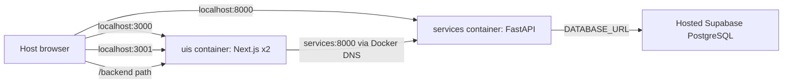

# Docker TLDR — Brasaland Monorepo

Use this guide to study the implementation or teach a short lesson about it.

## The 30-second explanation

Docker packages an application and its runtime into an **image**. An image
becomes a running **container**. Docker Compose reads `docker-compose.yml` and
starts the related containers, networks, environment variables, ports, and
volumes together.

Brasaland uses two containers:



The website and backoffice share one UI container because the assignment
requires it. FastAPI has its own container. Supabase stays outside Docker.

## Vocabulary

| Term | Meaning in this project |
|------|-------------------------|
| Image | Reproducible Node or Python filesystem built from a Dockerfile |
| Container | A running instance of an image |
| Dockerfile | Recipe that installs dependencies and defines the default command |
| Compose | Starts and connects the UI and API containers |
| Build context | Files Docker is allowed to read during `docker build` |
| Bind mount | Host source code mounted into a container for hot reload |
| Named volume | Docker-managed storage, used to protect Linux dependencies |
| Published port | Maps a host port such as 3001 to a container port |
| Service name | DNS hostname Compose provides inside its network |

## File map

```text
docker-compose.yml        Starts the entire development platform
.env                      Real local values; ignored by Git
.env.example              Safe variable names and placeholders
uis/Dockerfile            Builds one image for both Next.js apps
uis/start.sh              Starts website and backoffice together
uis/.dockerignore         Excludes UI build junk and secrets
services/Dockerfile       Builds the FastAPI image with uv
services/.dockerignore    Excludes Python junk, tests, and secrets
```

The Dockerfiles and primary build contexts live in `uis/` and `services/`
because the syllabus grades those exact paths. Compose supplies one additional
named BuildKit context to each image for its cross-folder dependency:

- backoffice → `apps/operations`
- FastAPI → `packages/incident-analysis`

Docker cannot `COPY` a file located outside its build context.

## What happens during a build

### UI image

1. Start from an official Node Alpine image.
2. Copy package manifests and the local operations package.
3. Run `npm ci` independently for website and backoffice.
4. Copy both UI applications and `start.sh`.
5. Expose ports 3000 and 3001.
6. Default to `sh /workspace/uis/start.sh`.

### API image

1. Start from an official slim Python image.
2. Copy `uv` from its official image.
3. Copy and install `services/api/requirements.txt`.
4. Copy and install `packages/incident-analysis`.
5. Copy the API source.
6. Start Uvicorn on `0.0.0.0:8000` with `--reload`.

`0.0.0.0` is essential: binding only to `127.0.0.1` would make the process
reachable only from inside its own container.

## What happens during `docker compose up`

1. Compose reads `.env` and `docker-compose.yml`.
2. It creates the named `brasaland-dev` bridge network.
3. It creates volumes for Linux `node_modules` and Next.js build caches.
4. It starts FastAPI and publishes port 8000.
5. It starts the UI container and publishes ports 3000 and 3001.
6. Bind mounts replace image source files with live host source files.
7. Next.js and Uvicorn watch those files and reload after edits.

## Ports: host versus container

`"3001:3001"` means `HOST:CONTAINER`.

| Application | Host URL | Container listener |
|-------------|----------|--------------------|
| Website | `http://localhost:3000` | `0.0.0.0:3000` |
| Backoffice | `http://localhost:3001` | `0.0.0.0:3001` |
| FastAPI | `http://localhost:8000` | `0.0.0.0:8000` |

Publishing a port is for traffic entering Docker from the host. Containers on
the same network communicate directly with service names and container ports.

## The networking detail most people get wrong

Inside the UI container, `localhost` means the UI container itself—not the API
container. Compose gives the API service the hostname `services`, so internal
traffic uses:

```text
http://services:8000
```

But JavaScript running in a host browser cannot resolve `services`; Docker DNS
exists only inside Docker. Brasaland solves this with a same-origin proxy:

```text
Browser → http://localhost:3001/backend/suppliers
Next.js → http://services:8000/suppliers
```

This both satisfies service-name networking and gives the browser a resolvable
URL.

## Volumes and hot reload

Bind mounts make local edits visible inside containers:

```text
./uis                 → /workspace/uis
./apps/operations     → /workspace/apps/operations
./services/api        → /workspace/services/api
./packages/incident-analysis → /workspace/packages/incident-analysis
./scripts/incidents-brasaland.csv → /workspace/scripts/incidents-brasaland.csv (read-only test fixture)
```

Do not bind-mount host `node_modules` into Linux containers. Native binaries
and paths can differ between Windows and Linux. Docker-managed named volumes
keep container dependencies intact while source remains live.

At startup, `start.sh` compares each mounted `package-lock.json` with a hash
stored in its dependency volume. It runs `npm ci` only when the lockfile has
changed, preventing a rebuilt image from continuing to use stale packages from
an older named volume.

Windows file events can be unreliable across bind mounts, so the UI enables
polling. Polling checks files repeatedly instead of waiting for filesystem
events.

## Environment and secrets

- `.env` contains actual local values and is ignored by Git.
- `.env.example` documents the required names with placeholders.
- Compose passes values into containers.
- Dockerfiles and `docker-compose.yml` contain no passwords or API keys.
- `NEXT_PUBLIC_*` values are visible to browser code and must never be secrets.
- `DATABASE_URL` lets FastAPI connect outward to hosted Supabase.

The API loads its old `services/api/.env` only as a local fallback. It must not
override values already injected by Compose.

## Command cheat sheet

```bash
# Validate the Compose model
docker compose config

# Build and run in the foreground
docker compose up --build

# Build and run in the background
docker compose up --build -d

# Show status and published ports
docker compose ps

# Follow all logs
docker compose logs -f

# Follow one service
docker compose logs -f services

# Seed suppliers and inventory
docker compose exec services python seed.py

# Run API tests
docker compose exec services python -m pytest tests

# Stop containers but retain named volumes
docker compose down

# Stop and delete named volumes
docker compose down -v

# Rebuild after dependency or Dockerfile changes
docker compose build --no-cache
```

Source edits should not need a rebuild. Rebuild when dependencies, lockfiles,
Dockerfiles, or build arguments change.

## Fast troubleshooting

| Symptom | Likely cause | Check |
|---------|--------------|-------|
| `invalid file request apps/...` while loading context | OneDrive Files On-Demand reparse points | Clone the repository under a local path such as `C:\dev` |
| `start.sh: illegal option` | Windows CRLF line endings | The UI command copies and normalizes the script with `dos2unix` |
| Browser cannot resolve `services` | Docker hostname leaked into browser code | Use the `/backend` proxy |
| UI starts but packages are missing | Bind mount hid installed dependencies | Check named `node_modules` volumes |
| Edit does not reload | Windows bind-mount events were missed | Check polling variables and logs |
| API import fails | Shared package is absent | Check root context and editable install |
| API exits at startup | `DATABASE_URL` missing or Supabase unreachable | Check ignored root `.env` |
| Port already allocated | Another local process owns 3000/3001/8000 | Stop it or inspect `docker compose ps` |
| Dependency sync fails | Lockfile and dependency volume are out of sync | Review the startup `npm ci` error, then rebuild |
| Reset link points somewhere wrong | Host-facing URL confused with Docker DNS | Keep reset URL on `localhost:3001` |

## Five-minute live demo

1. Show both Dockerfiles and explain that an image is a recipe result.
2. Show Compose and identify services, ports, volumes, environment, and network.
3. Run `docker compose up --build -d` and `docker compose ps`.
4. Open ports 3000, 3001, and 8000.
5. Edit visible UI text and show Next.js hot reload.
6. Change the `/health` response temporarily and show Uvicorn reload.
7. Trace one `/backend/health` request from browser → Next.js → `services`.
8. Undo the demo edits and run `docker compose down`.

## Questions you may be asked

**Why not install Node and Python directly?**
Docker makes runtime versions and dependencies reproducible. Developers still
need Docker, but not matching global Node/Python installations.

**Why one UI container?**
The syllabus explicitly requires it. Separate UI containers would usually
provide better lifecycle isolation, but would fail this project rubric.

**Why additional build contexts?**
Dockerfiles need shared packages outside `uis/` and `services/`. Named BuildKit
contexts provide those packages while preserving the syllabus-required primary
contexts and applying each folder's `.dockerignore`.

**Why does the browser use localhost while containers use service names?**
They run on different networks. Host browsers use published ports; containers
use Docker DNS.

**Is this production-ready?**
No. It intentionally runs development servers with source mounts and reload.
A production design would use multi-stage builds, immutable source, non-root
users, health-based startup, and a reverse proxy/TLS boundary.

**Does `depends_on` mean the API is ready?**
Not by itself. It controls startup order. Readiness requires a healthcheck and
a health-based dependency condition.

## Final mental model

```text
Dockerfile = how to build one image
Compose    = how containers run together
Image      = immutable package
Container  = running process
Volume     = data/source mounted at runtime
Network    = private container communication
Port       = host-to-container doorway
```
