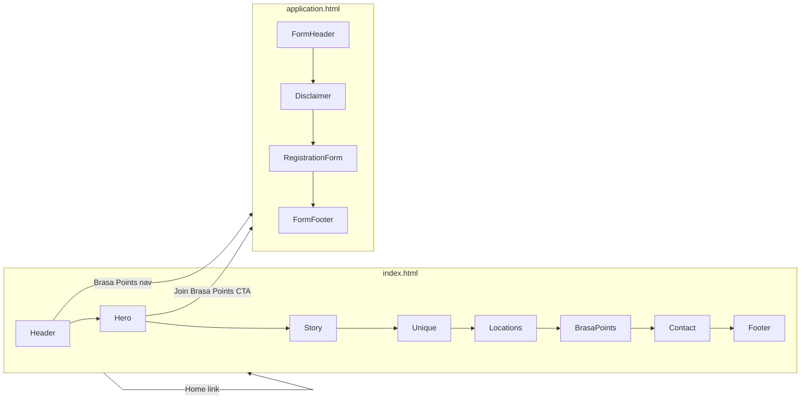
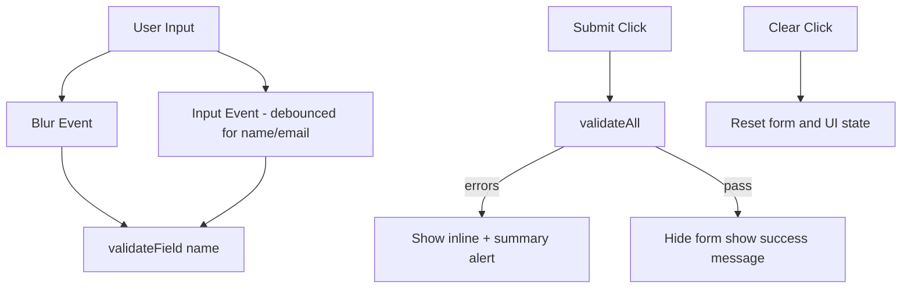

# Brasaland Milestone 1 — Complete Implementation Plan

**Scope:** Planning only. No code or files until approved.

**Source documents:**
- Domain & content: [ms-1-CONTEXT.md](ms-1-CONTEXT.md)
- Milestone rubric: [screenshots/ms-1/](screenshots/ms-1/) (technical requirements, landing/form checklists, validation rules, evaluation criteria, submission steps)
- Monorepo convention: [uis/README.md](uis/README.md) — public website lives under `uis/website/`

**Confirmed stack (per your decisions):** HTML5, Tailwind CSS (CDN), Vanilla JS, no TypeScript, no backend, simulated submission, placeholder images, frontend-only data, static hosting.

---

## Phase 1 — Requirements Analysis

### 1. Functional Requirements

| ID | Requirement | Priority | Implementation Notes |
|----|-------------|----------|----------------------|
| FR-01 | Landing page with ordered sections: Header, Hero, Our Story, What Makes Us Unique, Locations, Brasa Points, Contact, Footer | Required | Single-page `index.html`; section order fixed per CONTEXT |
| FR-02 | Separate Brasa Points registration page with all 11 form fields | Required | `application.html` per milestone checklist |
| FR-03 | Hero CTA "Join Brasa Points" links to registration page | Required | `<a href="application.html">` |
| FR-04 | Navigation: Home, Locations, Menu, Brasa Points, Contact | Required | Anchor links on landing; Brasa Points → `application.html` |
| FR-05 | Dynamic Country → City dropdown | Required | JS repopulates city `<select>` on country change |
| FR-06 | Dynamic Country + City → Favorite Location dropdown | Required | 14 locations filtered per CONTEXT mapping |
| FR-07 | Full client-side validation before submit | Required | `validation.js`; block submit on errors |
| FR-08 | Real-time validation (blur/input) | Required | Per screenshot rubric |
| FR-09 | Simulated success message on valid submit | Required | Exact copy from CONTEXT; hide form or show success panel |
| FR-10 | Clear/reset form button | Required | Resets fields, errors, dependent dropdowns |
| FR-11 | Visible ordering disclaimer message | Required | Exact CONTEXT copy about calling locations / online ordering coming soon |
| FR-12 | Language switcher EN \| ES | Recommended (user chose bilingual) | Header on both pages; persist choice in `localStorage` |
| FR-13 | Menu navigation target | Required (nav item) | No menu content in CONTEXT — add lightweight `#menu` section with placeholder categories + "full menu in-restaurant" note |

### 2. Non-Functional Requirements

| ID | Requirement | Priority | Implementation Notes |
|----|-------------|----------|----------------------|
| NFR-01 | Responsive: mobile, tablet, desktop | Required | Mobile-first Tailwind breakpoints |
| NFR-02 | WCAG AA accessibility | Required | Semantic HTML, labels, focus, contrast, SR announcements |
| NFR-03 | SEO optimization | Required | Meta tags, semantic headings, internal links |
| NFR-04 | Schema.org Restaurant JSON-LD on landing | Required | Exact structure from CONTEXT |
| NFR-05 | Tailwind-only styling | Required | CDN; avoid custom CSS unless unavoidable (e.g., `sr-only`) |
| NFR-06 | PageSpeed Insights ≥ 80 (90+ ideal) | Required | Minimize JS, optimize images, deploy to Vercel for testing |
| NFR-07 | Local dev via `npx http-server` | Required | Document in `uis/website/README.md`; Codespaces-compatible |
| NFR-08 | Professional visual design | Required | Cohesive grill/restaurant brand: warm palette, consistent spacing |
| NFR-09 | No console errors | Required | Verify in DevTools per submission checklist |
| NFR-10 | CONTEXT.md unmodified at repo root | Required | Copy Brasaland briefing to root `CONTEXT.md` if not already; do not edit during implementation |

### 3. Content Requirements

| ID | Content | Priority | Source |
|----|---------|----------|--------|
| CR-01 | Hero headline/subheadline/CTA | Required | CONTEXT lines 51–53 |
| CR-02 | Our Story paragraph | Required | CONTEXT lines 57–58 |
| CR-03 | 3 unique value columns | Required | CONTEXT lines 61–70 |
| CR-04 | Colombia + US location blocks with hours | Required | CONTEXT lines 74–80 |
| CR-05 | Brasa Points benefits (4 bullets) | Required | CONTEXT lines 86–89 |
| CR-06 | Contact: email, CO phone, FL phone | Required | CONTEXT lines 93–95 |
| CR-07 | Footer copyright + social links | Required | CONTEXT lines 99–100 |
| CR-08 | Form field labels and option values | Required | Must match CONTEXT exactly (evaluator warning in screenshot) |
| CR-09 | Error messages (8 specific strings) | Required | CONTEXT lines 157–164 |
| CR-10 | Success message (3 paragraphs) | Required | CONTEXT lines 172–176 |
| CR-11 | Ordering disclaimer | Required | CONTEXT line 182 |
| CR-12 | Placeholder hero/story images with descriptive alt | Required | Placeholder URLs or local assets |
| CR-13 | Spanish translations for all user-facing strings | Recommended | Separate JSON files; EN complete first |

### 4. Validation Requirements

| Field | Rules | Priority |
|-------|-------|----------|
| Full name | Min 2 words (trim, split on whitespace) | Required |
| Email | Valid format (`@` + domain) | Required |
| Phone | Starts with `+`; `+57` if Colombia selected, `+1` if US selected | Required |
| Country | Must select Colombia or United States | Required |
| City | Must select valid city for country | Required |
| Favorite location | Optional; if country/city changes, reset selection | Optional |
| Dietary preferences | Optional multi-checkbox | Optional |
| How did you find us | Must select one option | Required |
| Date of birth | Valid date; age ≥ 18 | Required |
| Accept terms | Must be checked | Required |
| Receive offers | Optional; unchecked default | Optional |

### 5. Accessibility Requirements

| ID | Requirement | Priority |
|----|-------------|----------|
| A11Y-01 | Semantic landmarks: `header`, `nav`, `main`, `section`, `footer` | Required |
| A11Y-02 | Single logical `h1`; descending heading hierarchy | Required |
| A11Y-03 | All images have meaningful `alt` | Required |
| A11Y-04 | Every input has associated `<label for>` | Required |
| A11Y-05 | Form groups use `fieldset`/`legend` (personal info, preferences, consent) | Required |
| A11Y-06 | Required fields marked visually and programmatically (`required`, `aria-required`) | Required |
| A11Y-07 | Errors linked via `aria-describedby`; `aria-invalid="true"` on error | Required |
| A11Y-08 | Error summary region with `role="alert"` or `aria-live="polite"` on submit | Required |
| A11Y-09 | Keyboard navigable nav, mobile menu, form, language switcher | Required |
| A11Y-10 | Visible focus rings (Tailwind `focus-visible:`) | Required |
| A11Y-11 | Color contrast ≥ 4.5:1 body text, 3:1 large text/UI | Required |
| A11Y-12 | Skip link "Skip to main content" | Recommended |
| A11Y-13 | `lang` attribute updates on language switch (`en` / `es`) | Recommended |

### 6. SEO Requirements

| ID | Requirement | Priority |
|----|-------------|----------|
| SEO-01 | Unique `<title>` per page (≤ 60 chars) | Required |
| SEO-02 | Meta description per page (≤ 160 chars) | Required |
| SEO-03 | Canonical URL meta (placeholder `https://brasaland.com`) | Recommended |
| SEO-04 | Open Graph tags (title, description, image, url) | Recommended |
| SEO-05 | Logical H1–H3 structure with keywords naturally | Required |
| SEO-06 | Internal links: landing ↔ form, section anchors | Required |
| SEO-07 | Meta keywords | Optional (low SEO value; include sparingly if at all) |

### 7. Schema.org Requirements

| Property | Value | Priority |
|----------|-------|----------|
| `@type` | Restaurant | Required |
| `name` | Brasaland | Required |
| `description` | Grilled food restaurant chain… | Required |
| `url` | https://brasaland.com | Required |
| `foundingDate` | 2008 | Required |
| `servesCuisine` | Grilled food, Colombian cuisine | Required |
| `priceRange` | $$ | Required |
| `address` | 2 PostalAddress objects (CO + US) | Required |
| `contactPoint` | telephone, customer service, availableLanguage | Required |
| `sameAs` | Instagram + Facebook URLs | Required |
| Placement | `<script type="application/ld+json">` in `index.html` `<head>` or before `</body>` | Required |
| Bilingual | `availableLanguage: ["Spanish", "English"]` since both languages ship | Required |

### 8. Responsive Design Requirements

| Breakpoint | Tailwind | Target |
|------------|----------|--------|
| Mobile | default (< 640px) | Single column, hamburger nav |
| Tablet | `sm:` / `md:` (640–1023px) | 2-column where appropriate |
| Desktop | `lg:` (1024px+) | Full horizontal nav, multi-column grids |
| Large desktop | `xl:` / `2xl:` (1280px+) | Max-width container, generous whitespace |

### 9. Multilingual Requirements

| ID | Requirement | Priority |
|----|-------------|----------|
| ML-01 | Base language: English (complete first) | Required |
| ML-02 | Secondary: Spanish via language switcher | Required (user decision) |
| ML-03 | Do not reduce EN quality for ES | Required |
| ML-04 | Translate: nav, sections, form labels, errors, success, disclaimer, buttons | Required |
| ML-05 | Keep field **values** used in validation logic stable (use `data-i18n` for display, `value` attrs in EN for logic OR map consistently) | Required |
| ML-06 | Persist language preference | Recommended |
| ML-07 | `hreflang` link tags for EN/ES if separate URLs not used, document single-URL approach | Optional |

---

## Phase 2 — Website Structure

### Pages



| Page | File | Purpose |
|------|------|---------|
| Landing Page | `uis/website/index.html` | Brand presentation, locations, loyalty program promo |
| Brasa Points Registration | `uis/website/application.html` | Loyalty signup form with validation |

### Navigation Strategy

**Landing page (`index.html`):**

| Nav Item | Behavior |
|----------|----------|
| Home | `#home` (hero) — scroll to top |
| Locations | `#locations` — in-page anchor |
| Menu | `#menu` — in-page anchor (placeholder section) |
| Brasa Points | `application.html` (separate page) |
| Contact | `#contact` — in-page anchor |

**Registration page (`application.html`):**
- Same header/footer for consistency
- Nav "Home" → `index.html`
- Nav "Brasa Points" → current page (aria-current)
- Logo → `index.html`

**Mobile navigation:**
- Hamburger button (`aria-expanded`, `aria-controls="mobile-menu"`)
- Full-width overlay or slide-down panel
- Trap focus optional; close on Escape and link click
- Same links as desktop; sticky header on scroll (recommended)

**Anchor vs separate sections:** All landing content sections are same-page anchors except Brasa Points (separate HTML file per milestone). Menu has no CONTEXT content — implement as minimal `#menu` section to satisfy nav without dead links.

---

## Phase 3 — Landing Page Section Checklists

### Header
- **Requirements:** Logo/name "Brasaland"; nav items; language switcher ES \| EN; sticky optional
- **Content:** Brand text logo; 5 nav links
- **A11y:** `<nav aria-label="Main">`; mobile toggle labeled; current page indication
- **Responsive:** Desktop horizontal nav; mobile hamburger + vertical stack

### Hero (`#home`)
- **Requirements:** Headline, subheadline, CTA button
- **Content:** Exact CONTEXT copy
- **CTA:** Primary button → `application.html`; clear focus/hover states
- **Responsive:** Centered text mobile; optional side-by-side with image on `lg:`

### Our Story (`#story`)
- **Requirements:** Paragraph + image
- **Content:** CONTEXT paragraph
- **Image:** Placeholder grill/restaurant image; alt describing Brasaland story
- **Responsive:** Stack image above/below text mobile; 2-column `md:` or `lg:`

### What Makes Us Unique (`#unique`)
- **Requirements:** 3 columns
- **Content:** Consistent Quality, Warm Experience, Speed (with sub-bullets)
- **Layout:** CSS grid `grid-cols-1 md:grid-cols-3`; icons optional (decorative `aria-hidden`)
- **Responsive:** Stack → 3 equal columns

### Locations (`#locations`)
- **Requirements:** 2 country columns
- **Content:** Colombia (10 restaurants, hours); US Florida (4 restaurants, hours)
- **Grouping:** Two cards/columns with country headings
- **Responsive:** Stack mobile; 2-column `md:`

### Menu (`#menu`) — planned addition
- **Requirements:** Satisfy nav item; no ordering
- **Content:** Brief intro + placeholder categories (grilled meats, sides, beverages); link to visit in person
- **CTA:** Reinforce disclaimer about calling for orders

### Brasa Points (`#brasa-points`)
- **Requirements:** Featured section with 4 benefit bullets
- **Content:** CONTEXT bullets including digital registration message
- **CTA:** Secondary button/link → `application.html`

### Contact (`#contact`)
- **Requirements:** Email + two phone numbers
- **Content:** `hello@brasaland.com`, +57 4 123 4567, +1 305 123 4567
- **A11y:** `mailto:` and `tel:` links with readable labels

### Footer
- **Requirements:** Copyright © 2025; Instagram \| Facebook
- **Content:** Exact CONTEXT; social links open new tab with `rel="noopener"`
- **Responsive:** Center mobile; flex row desktop

---

## Phase 4 — Registration Form Specification

**Page elements (above form):** Page title, intro text, ordering disclaimer (CONTEXT restriction).

**Form structure:** `<form id="brasa-points-form" novalidate>` — use `novalidate` to rely on custom JS.

| Field | Type | Required | Validation | Error Message | A11y |
|-------|------|----------|------------|---------------|------|
| Full Name | `text` | Yes | Trim; ≥2 words | "Enter your full name (first and last name)" | `<label for="fullName">`; `autocomplete="name"` |
| Email | `email` | Yes | Regex: `^[^\s@]+@[^\s@]+\.[^\s@]+$` | "Enter a valid email (example: name@email.com)" | `autocomplete="email"` |
| Phone | `tel` | Yes | Must match `^\+\d[\d\s-]{7,}$`; country code matches selection (+57/+1) | "Phone must include country code (example: +57 300 123 4567 or +1 305 123 4567)" | `autocomplete="tel"`; hint text |
| Country | `select` | Yes | Non-empty | "Select your country" | First option disabled placeholder |
| City | `select` | Yes | Non-empty; valid for country | "Select your city" | Disabled until country selected |
| Favorite Location | `select` | No | Valid for country+city if selected | N/A (optional) | Disabled until city selected; include empty "Select a location" |
| Dietary Preferences | checkbox group | No | None | N/A | `fieldset`/`legend`; options: No restrictions, Vegetarian, Gluten-free, Other |
| How Did You Find Us | `select` | Yes | Non-empty | "Tell us how you found Brasaland" | Options: Social media, Recommendation, Walked by, Internet search, Other |
| Date of Birth | `date` | Yes | Valid date; age ≥ 18 (compare to today) | "You must be 18 or older to register for Brasa Points" | `max` attribute set dynamically to today−18 years as UX hint |
| Accept Terms | checkbox | Yes | Must be checked | "You must accept the Brasa Points program terms to continue" | Link to `#` placeholder terms |
| Receive Offers | checkbox | No | None | N/A | Unchecked by default |

**Buttons:**
- Submit: "Register" / "Join Brasa Points" — `type="submit"`
- Clear: `type="button"` — resets form, errors, dropdowns, success state

---

## Phase 5 — Dynamic Logic Planning

### Data file: `uis/website/data/locations.js` (or `.json`)

Central source for country → city → locations (14 total). Imported/referenced by dropdown + validation modules.

### Country → City Mapping

| Country | Cities Shown |
|---------|----------------|
| Colombia | Medellín, Bogotá, Cali |
| United States | Miami, Orlando |

### Country + City → Favorite Location Mapping

| Country | City | Locations (value → label) |
|---------|------|---------------------------|
| Colombia | Medellín | Brasaland El Poblado, Brasaland Laureles, Brasaland Envigado, Brasaland Sabaneta |
| Colombia | Bogotá | Brasaland Usaquén, Brasaland Chapinero, Brasaland Zona Rosa |
| Colombia | Cali | Brasaland Granada, Brasaland Ciudad Jardín, Brasaland Unicentro |
| United States | Miami | Brasaland Brickell, Brasaland Coral Gables |
| United States | Orlando | Brasaland Downtown, Brasaland International Drive |

### Default States
- Country: placeholder "Select your country"
- City: disabled, single placeholder
- Favorite location: disabled, optional empty option

### Reset Behavior
- **Country change:** Clear city + favorite location; repopulate cities; disable favorite until city chosen
- **City change:** Clear favorite location; repopulate locations for pair
- **Clear button:** Reset all fields to initial state including disabled selects

### Edge Cases
- User selects city then changes country → city invalid; clear dependent fields
- Submit with stale city (tampered DOM) → validation rejects city not in allowed list
- DOB on leap day / timezone → calculate age using UTC date parts consistently
- Phone country mismatch (Colombia + +1) → show phone error even if format valid
- Multiple dietary checkboxes allowed; "No restrictions" may coexist or mutually exclusive (recommend allow multiple, no validation)

### Validation Integration
- Re-validate city when country changes
- Re-validate favorite location when country/city changes (only if value set)
- Phone re-validates on country change

---

## Phase 6 — Validation Strategy

### Architecture (`validation.js` + helpers)



| Concern | Strategy |
|---------|----------|
| Real-time | Validate on `blur` for all fields; on `input` for name/email/phone (debounce 300ms) |
| On submit | Run full validation; focus first invalid field; announce error count |
| Error display | Red border (`border-red-500`), inline message below field, icon optional |
| Success | Replace form with success panel; exact CONTEXT copy; `role="status"` |
| HTML5 | Use `novalidate`; keep `required` for baseline a11y |

**Full Name:** Split on whitespace; filter empty tokens; require `length >= 2`.

**Email:** Standard pattern; trim whitespace.

**Phone:** Regex + cross-check selected country (`Colombia` → must start with `+57`; `United States` → `+1`).

**DOB 18+:** `const age = floor((today - dob) / 365.25 days)` or precise year/month/day comparison.

**Required selects:** Value must not equal placeholder sentinel (e.g., `""`).

**Terms:** `checkbox.checked === true`.

---

## Phase 7 — Accessibility Checklist (WCAG AA)

- [ ] One `h1` per page
- [ ] Landmarks: banner, navigation, main, contentinfo
- [ ] Skip link to `#main`
- [ ] All interactive elements reachable via Tab; logical tab order
- [ ] Mobile menu operable with Enter/Space/Escape
- [ ] Language switcher is `<button>` or links with clear accessible names
- [ ] Form errors: `aria-invalid`, `aria-describedby` pointing to error `<span id="field-error">`
- [ ] Submit errors: `role="alert"` container at form top
- [ ] Success message: `role="status"` + focus move to success heading
- [ ] Checkboxes/radios: visible labels, sufficient click target (min 44×44px touch)
- [ ] Color not sole error indicator (text + border)
- [ ] Test with keyboard only and screen reader (NVDA/VoiceOver)
- [ ] Document language: `<html lang="en">` default; update to `es` on switch

---

## Phase 8 — SEO Implementation Plan

### `index.html` Meta
- **Title:** `Brasaland | Grilled Food in Colombia & Florida`
- **Description:** Chain founded 2008; 14 locations; Brasa Points loyalty program
- **Keywords (optional):** grilled restaurant, Medellín, Miami, Brasa Points

### Open Graph (both pages, tuned per page)
- `og:title`, `og:description`, `og:image` (placeholder hero), `og:url`, `og:type=website`, `og:locale` + `og:locale:alternate`

### `application.html` Meta
- **Title:** `Join Brasa Points | Brasaland Loyalty Program`
- **Description:** Register for digital loyalty; earn points at 14 locations

### Technical SEO
- Semantic section IDs matching nav anchors
- Descriptive link text (avoid "click here")
- Footer links to social profiles
- Fast load: Tailwind CDN, defer non-critical JS, compressed placeholder images
- Deploy to Vercel; run PageSpeed before submission

---

## Phase 9 — Schema.org Planning

**Placement:** Inline JSON-LD in [`uis/website/index.html`](uis/website/index.html) — not on form page (restaurant entity is brand-level).

**Implementation:** Copy exact JSON from CONTEXT; minify for production; validate with [Google Rich Results Test](https://search.google.com/test/rich-results).

**Bilingual impact:** With EN + ES implemented, set:
```json
"availableLanguage": ["Spanish", "English"]
```
If only EN shipped, would be `["English"]` only — not applicable given bilingual decision.

**Verification checklist:** All 10 top-level properties present; 2 addresses; contactPoint with telephone; sameAs array with 2 URLs.

---

## Phase 10 — Multilingual Planning

### Translation Storage
```
uis/website/i18n/
  en.json
  es.json
```
Keys by section: `nav.home`, `hero.headline`, `form.errors.fullName`, etc.

### Language Switching
- Header toggle: `EN | ES` buttons
- `i18n.js`: load JSON, apply to `[data-i18n]` elements
- Store preference: `localStorage.setItem('brasaland-lang', 'en'|'es')`
- On load: read preference, apply before paint if possible (inline script in head) to avoid flash

### Content Organization
- EN strings are source of truth in JSON
- Form **option values** for validation: use stable English keys internally (`Colombia`, `Medellín`, etc.) OR validate against keys while displaying translated labels
- Error messages: lookup by key from active locale JSON — Spanish versions of the 8 CONTEXT error strings

### A11y + SEO
- Update `<html lang>` and `aria-label` on switch
- Consider `<meta name="description">` swap per language via JS (acceptable for static milestone)
- Document that single URL serves both languages (no separate `/es/` path)

**Do not generate translations during planning phase** — structure only.

---

## Phase 11 — Responsive Design by Section

| Section | Mobile | Tablet (`md:`) | Desktop (`lg:`) | Large (`xl:`) |
|---------|--------|----------------|-----------------|---------------|
| Header | Logo + hamburger | Same or partial inline | Full horizontal nav | Max-w-7xl container |
| Hero | Stacked, full-width CTA | Larger typography | Optional 2-col with image | Increased padding |
| Our Story | Image stack | 2-col 50/50 | 2-col | Wider image |
| Unique | 1 col | 2 col then 3 | 3 col grid | Gap increase |
| Locations | 1 col | 2 col | 2 col cards | Side-by-side equal height |
| Brasa Points | Full-width card | Padding increase | Highlight band/full bleed | — |
| Contact | Stacked links | Centered block | Inline or grid | — |
| Footer | Stacked centered | Row layout | Row with spacing | — |
| Form | Full-width inputs | max-w-2xl centered | 2-col for name/email row optional | max-w-3xl |

**Grid strategy:** Tailwind `grid`, `flex`, `gap-4/6/8`, `px-4 sm:px-6 lg:px-8`.

---

## Phase 12 — Project Structure

```
uis/website/
├── index.html              # Landing page
├── application.html        # Registration form
├── js/
│   ├── validation.js       # All field validators + submit handler
│   ├── dropdowns.js        # Country/city/location cascading logic
│   ├── i18n.js             # Language loading and DOM updates
│   └── main.js             # Mobile nav, smooth scroll, init
├── i18n/
│   ├── en.json
│   └── es.json
├── data/
│   └── locations.js        # Country/city/location hierarchy (14 restaurants)
├── images/
│   └── placeholders/       # Hero, story placeholders
└── README.md               # Run instructions, structure, deploy notes
```

**Why each folder:**
- `js/` — separation of validation, i18n, and UI init (milestone requires `validation.js`; may re-export from module pattern or single file with sections)
- `i18n/` — bilingual content without cluttering HTML
- `data/` — single source for dropdowns (evaluator-exact location names)
- `images/` — placeholder assets with alt text paths

**Note:** Milestone submission lists `validation.js` at project root — place at `uis/website/validation.js` OR `uis/website/js/validation.js` and reference in HTML; document path in README. Prefer flat `validation.js` at website root if strict autograder expects that filename alongside HTML.

**Recommended flat milestone layout:**
```
uis/website/
  index.html
  application.html
  validation.js      # ← milestone-required name
  js/dropdowns.js
  js/i18n.js
  js/main.js
  ...
```

---

## Phase 13 — Reusable Components (HTML partials / JS render helpers)

Since no framework, implement as **consistent HTML patterns** (+ optional JS template functions):

| Component | Responsibility |
|-----------|----------------|
| Site Header | Logo, nav, language switcher, mobile menu |
| Site Footer | Copyright, social links, optional repeat nav |
| Language Switcher | Toggle EN/ES; update `lang`; persist preference |
| Section Title | Shared heading + optional subtitle classes |
| CTA Button | Primary/secondary variants; consistent padding/focus |
| Form Input | Label + input + error slot structure |
| Select Field | Label + select + disabled states + error slot |
| Checkbox Group | Fieldset/legend + checkbox list |
| Error Message | Inline span with id for `aria-describedby` |
| Success Panel | Post-submit welcome message container |
| Location Card | Reusable card for Colombia/US blocks |

**DRY approach:** Duplicate header/footer in both HTML files (milestone simplicity) OR load via small JS fetch of `partials/header.html` (optional; static duplicate is safer for milestone).

---

## Phase 14 — Testing Plan

### Form Validation

| Scenario | Expected Result |
|----------|-----------------|
| Submit empty form | All required errors shown; submit blocked |
| Single-word name | Full name error |
| Invalid email `test@` | Email error |
| Phone without `+` | Phone error |
| Colombia + `+1 305...` | Phone error |
| US + `+57 300...` | Phone error |
| No country selected | Country error |
| Country without city | City error |
| DOB under 18 | DOB error |
| Terms unchecked | Terms error |
| All valid data | Success message; form hidden/replaced |

### Dynamic Dropdown Logic

| Scenario | Expected Result |
|----------|-----------------|
| Select Colombia | Cities: Medellín, Bogotá, Cali |
| Select United States | Cities: Miami, Orlando |
| Medellín selected | 4 Medellín locations |
| Change country after selections | City + location reset |
| Clear button | All fields and dropdowns reset |

### Responsive Design

| Scenario | Expected Result |
|----------|-----------------|
| 375px width | No horizontal scroll; hamburger works |
| 768px width | Grids adapt; readable typography |
| 1280px+ | Full nav; multi-column sections |

### Accessibility

| Scenario | Expected Result |
|----------|-----------------|
| Tab through form | Logical order; visible focus |
| Screen reader on error | Error announced |
| Mobile menu keyboard | Open/close operable |

### SEO

| Scenario | Expected Result |
|----------|-----------------|
| View source index | JSON-LD present and valid |
| Unique titles | index vs application differ |

### Successful Submission Flow

| Scenario | Expected Result |
|----------|-----------------|
| Valid submit | Exact success copy; no network call |
| Submit again after clear | Form works fresh |

### Language Switching

| Scenario | Expected Result |
|----------|-----------------|
| Switch to ES | UI text Spanish; `lang="es"` |
| Reload page | Preference persisted |
| Form errors in ES | Translated error strings |

---

## Phase 15 — Risks and Assumptions

### Assumptions
- Tailwind via CDN is acceptable (no build step)
- Placeholder images from picsum/placeholder.com or local SVGs
- `CONTEXT.md` at repo root contains Brasaland briefing (copy from `ms-1-CONTEXT.md`)
- Submission evaluates files under repo; `uis/website/` path documented in root README
- Vercel or similar static host available for PageSpeed test
- No real email/backend integration

### Risks

| Risk | Mitigation |
|------|------------|
| Menu nav with no CONTEXT content | Add `#menu` placeholder section |
| Strict file path expectations | Include `validation.js` at website folder root; list paths in README |
| PageSpeed with Tailwind CDN | Minimize DOM, optimize images, defer JS |
| Bilingual + validation value mismatch | Use stable internal values; translate labels only |
| Phone validation edge cases | Document accepted formats; test both +57 and +1 examples |
| Date input browser differences | Use `input[type=date]` + JS age calc fallback |

---

## Phase 16 — Milestone Completion Checklist

### Files
- [ ] `uis/website/index.html` — semantic landing page, all sections in order
- [ ] `uis/website/application.html` — full form + disclaimer
- [ ] `uis/website/validation.js` — all validations + success simulation
- [ ] Root `CONTEXT.md` — present, unmodified Brasaland content

### Landing Page Content (exact CONTEXT copy)
- [ ] Header: Brasaland, nav (5 items), language switcher
- [ ] Hero headline, subheadline, CTA → form
- [ ] Our Story paragraph + image
- [ ] 3 unique columns
- [ ] Locations: Colombia + US with hours
- [ ] Brasa Points 4 bullets
- [ ] Contact email + phones
- [ ] Footer © 2025 + social links

### Form
- [ ] All 11 fields with correct types
- [ ] Labels, fieldsets, required attributes
- [ ] Submit + Clear buttons
- [ ] 8 exact error messages
- [ ] Success message exact copy
- [ ] Ordering disclaimer visible

### Dynamic Logic
- [ ] Country → city filtering
- [ ] Country + city → 14 locations
- [ ] Reset on dependency change

### Technical
- [ ] Tailwind mobile-first; sm/md/lg breakpoints
- [ ] No unnecessary custom CSS
- [ ] Schema.org Restaurant JSON-LD on landing
- [ ] Meta title + description both pages
- [ ] Alt text all images
- [ ] `npx http-server . -p 3000` documented
- [ ] No console errors
- [ ] PageSpeed ≥ 80 on deployed URL

### Bilingual
- [ ] EN primary complete
- [ ] ES secondary via switcher
- [ ] Schema `availableLanguage` both languages

### Pre-submission
- [ ] Test all validations manually
- [ ] Test responsive DevTools (375, 768, 1280)
- [ ] Push to repo; submit repo URL

---

## Implementation Order (post-approval)

1. Scaffold `uis/website/` + README + Tailwind CDN boilerplate
2. Build `index.html` structure and all sections with EN content
3. Add Schema.org, meta tags, header/footer
4. Build `application.html` form markup with fieldsets
5. Implement `data/locations.js` + `dropdowns.js`
6. Implement `validation.js` (real-time + submit + clear + success)
7. Add `i18n/` + language switcher
8. Polish responsive layout and accessibility
9. Placeholder images + final visual pass
10. Deploy to Vercel; PageSpeed + manual test checklist
11. Update root README with link to website

**Awaiting your approval before any implementation.**
