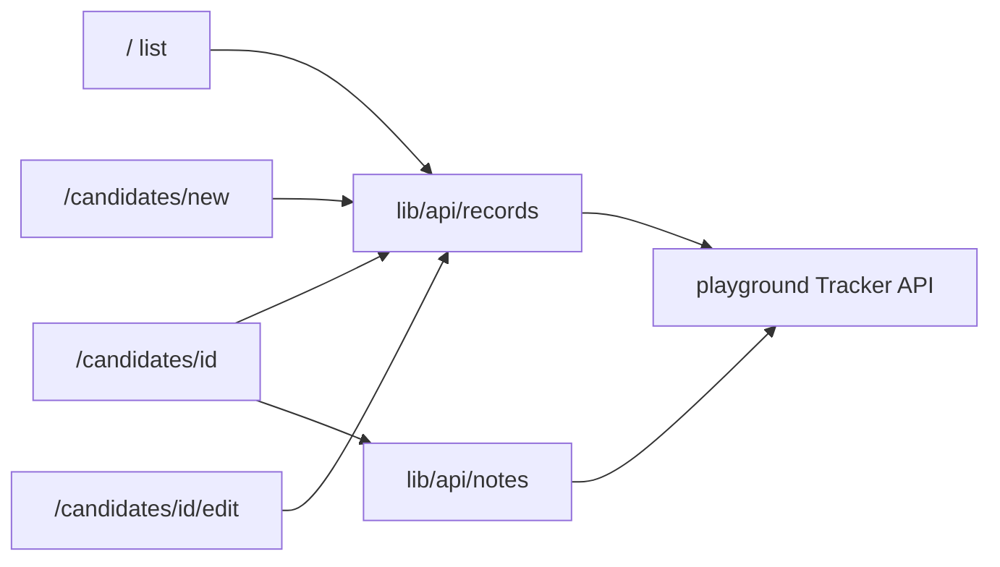

# Milestone 3 — Talent Pipeline Tracker

**Source documents:**
- Domain & content: [ms-3-CONTEXT.md](ms-3-CONTEXT.md)
- Implementation root: `uis/talent-pipeline-tracker/`

## Decisions locked

- App path: `uis/talent-pipeline-tracker/`
- Register / edit: separate pages (`/candidates/new`, `/candidates/[id]/edit`)
- Stack: Next.js (App Router) + TypeScript + Tailwind + ESLint
- State: React hooks only (no Redux/Zustand/Jotai)
- API base: `NEXT_PUBLIC_API_URL=https://playground.4geeks.com/tracker/api/v1`
- UI language: English, Brasaland People framing; status/stage always show human labels from CONTEXT
- Visual design: included — usable, branded, and intentional (not bare Bootstrap-style CRUD)

## UI direction (Brasaland People tool)

Internal ops tool for Ashley’s team — calm and scannable, not a marketing landing page and not a dense “admin dashboard” chrome.

**Visual system**

- **Theme:** light charcoal workspace with a warm flame accent (grill heritage without cream+terracotta+serif broadsheet clichés, and without purple gradients).
- **CSS variables** in `app/globals.css`: `--color-ink`, `--color-paper`, `--color-surface`, `--color-accent`, `--color-accent-soft`, `--color-border`, `--color-success`, `--color-danger`, status/stage badge colors.
- **Typography:** `Fraunces` for the Brasaland wordmark / page titles; `Plus Jakarta Sans` for UI body, tables, and forms (via `next/font/google`).
- **Background:** soft warm-gray base with a subtle radial wash behind the header (atmosphere without flat white).
- **Surfaces:** open layout — filters and tables sit on the page, not nested card stacks. Use a bordered surface only where interaction needs a clear container (forms, notes composer).
- **Status / stage:** compact labeled badges with distinct colors; always CONTEXT labels, never raw API strings.
- **Motion (2–3 intentional):** (1) list rows fade/slide in on load, (2) soft pulse or skeleton for loading, (3) brief success toast/banner after save/PATCH/note actions. No decorative animation noise.

**UX patterns (user-friendly)**

- Sticky top bar: **Brasaland** brand + “Talent Pipeline” + primary CTA “Register candidate”.
- List page: search + status/stage filters on one toolbar row; clear “Clear filters”; empty state with CTA when no matches.
- Clickable rows → detail; obvious Edit link on detail.
- Detail: profile block + status/stage controls in one glance; notes below with add/delete and confirm on delete.
- Forms: labeled fields, required markers, inline validation before submit, disabled submit while saving, success/error banners.
- Mobile: stacked toolbar, horizontal scroll or stacked candidate rows so all required fields remain readable.

## Target folder structure

Names map to what each folder owns:

```text
uis/talent-pipeline-tracker/
├── app/
│   ├── layout.tsx                 # fonts + AppShell
│   ├── page.tsx                   # Candidate list (/)
│   ├── candidates/
│   │   ├── new/page.tsx           # Register candidate (POST)
│   │   └── [id]/
│   │       ├── page.tsx           # Detail + status/stage + notes
│   │       └── edit/page.tsx      # Edit candidate (PUT)
│   └── globals.css                # design tokens + base styles
├── components/
│   ├── layout/
│   │   └── AppShell.tsx           # brand header, nav, page frame
│   ├── candidates/                # List page pieces
│   │   ├── CandidateTable.tsx
│   │   ├── CandidateFilters.tsx   # status + stage via useSearchParams
│   │   └── CandidateSearch.tsx    # name/email search (URL param)
│   ├── detail/                    # Detail page pieces
│   │   ├── CandidateProfile.tsx
│   │   ├── StatusStageForm.tsx    # PATCH status/stage
│   │   └── NotesPanel.tsx         # list / add / delete notes
│   ├── forms/
│   │   └── CandidateForm.tsx      # shared create + edit fields
│   ├── badges/
│   │   ├── StatusBadge.tsx
│   │   └── StageBadge.tsx
│   └── feedback/                  # loading / error / success / empty
│       ├── LoadingState.tsx
│       ├── ErrorState.tsx
│       ├── EmptyState.tsx
│       └── FormFeedback.tsx
├── hooks/
│   ├── useCandidates.ts
│   ├── useCandidate.ts
│   └── useNotes.ts
├── lib/
│   ├── api/
│   │   ├── client.ts
│   │   ├── records.ts
│   │   └── notes.ts
│   └── labels/
│       ├── status.ts
│       └── stage.ts
├── types/
│   ├── candidate.ts
│   └── note.ts
├── .env.local
└── README.md
```



## Routes and behavior

| Route | Purpose | API |
| ----- | ------- | --- |
| `/` | List name, position, status, stage; filters + search | `GET /records?status&stage&search` |
| `/candidates/[id]` | Full profile; PATCH status/stage; notes CRUD | `GET/PATCH /records/:id`, notes endpoints |
| `/candidates/new` | Register form with required-field validation | `POST /records` |
| `/candidates/[id]/edit` | Edit form (same fields as create) | `PUT /records/:id` |

- Filters and search use `useSearchParams` (no full reload); sync `status`, `stage`, `search` into the URL and pass them to `GET /records`.
- After PATCH/PUT/POST/DELETE, update local state so the UI reflects changes without a hard reload.
- Every async path exposes **loading / success / error** UI (plus empty state on the list).

## API types (from OpenAPI)

**Create/Update body (`RecordCreate`):** required `full_name`, `email`, `phone`, `position`, `experience_years`; optional `linkedin_url`, `cv_url`.

**Record out:** also `id`, `status`, `stage`, `notes_count`, `applied_at`, `updated_at`.

**Patch:** only `status` and/or `stage`.

**Note create:** `{ content }` (min length 1).

Labels live only in `lib/labels/` — UI never renders raw values like `in_progress` or `personal_interview`.

## Brasaland context in the UI

- Frame the tool for Ashley / People & Talent (Executive Assistant pipeline), not as a generic “records” CRUD.
- Copy: “Talent Pipeline”, “Candidates”, “Internal notes”, status/stage dropdowns with CONTEXT labels.
- Root `CONTEXT.md` / `CONTEXT.es.md` hold the Milestone 3 Brasaland talent context.

## Implementation order

1. Scaffold with `create-next-app`, `.env.local`, fonts, and CSS tokens.
2. Add `types/`, `lib/api/`, `lib/labels/`.
3. Build `AppShell`, badges, and feedback components.
4. Build list page (`/`) with filters, search, loading/error/empty.
5. Build detail page with profile, status/stage PATCH, notes panel.
6. Build shared `CandidateForm` + new/edit pages with validation feedback.
7. Wire CONTEXT + README; smoke-check against the live API on desktop and mobile widths.

## Out of scope

- External state libraries, auth, delete-candidate UI (API has DELETE record but assignment does not require it).
- Marketing-style full-bleed hero or multi-section landing page (this is an internal tool).
